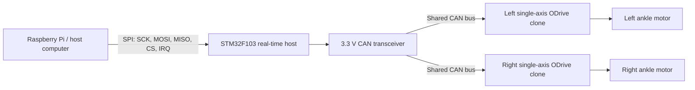

# Humanoid Robot

An open, human-sized humanoid robotics project focused on modular mechanical design, high-torque joint actuation, and a distributed real-time control system.

> [!IMPORTANT]
> This project is under active development. Dimensions, electrical ratings, firmware interfaces, and safety systems are not yet final. Do not energize an actuator until its current limits, mechanical stops, emergency-stop path, and load cases have been verified.

## Project status

| Area | Current state | Next milestone |
| --- | --- | --- |
| Mechanical design | Shin and actuator CAD is in the repository | Define full leg interfaces and fasteners |
| Actuation | Cycloidal and planetary C6374 concepts are present | Select and bench-test the preferred transmission |
| Ankle electronics | Dual ODrive-to-STM32-to-host schematic drafted | Verify exact connector pinouts and build the harness |
| Embedded firmware | To be documented | Define CAN messages, SPI protocol, and fault states |
| Host software | To be documented | Select the host computer and establish command/telemetry software |
| Safety | Requirements not yet frozen | Add E-stop, contactor, precharge, fusing, limits, and test procedures |

## Goals

- Build a modular humanoid platform that can be developed one joint and limb at a time.
- Keep mechanical, electrical, firmware, and host-computer interfaces documented and replaceable.
- Use high-torque BLDC joint actuators with closed-loop control.
- Separate hard real-time motor control from higher-level planning and perception.
- Make the design reproducible through versioned CAD, schematics, firmware, test data, and a traceable BOM.

## Current system concept

The current ankle-control concept uses two single-axis ODrive 3.6-compatible controllers. Each controller drives one ankle motor. An STM32F103-class controller coordinates the motor drives over CAN, while a Raspberry Pi or similar host communicates with the STM32 over SPI.



The current block-level schematic is in [`Schematics/`](Schematics/). Connector pin numbers are proposed harness definitions and must be mapped to the exact controller boards before wiring.


## Repository layout

```text
Humanoid-Robot/
├── CAD/
│   ├── Actuators/
│   │   ├── Cyclodial C6374/
│   │   └── Planetary C6374/
│   └── Assembly/
├── Schematics/
│   ├── humanoid.kicad_pro
│   ├── humanoid.kicad_sch
│   └── schematic.png
├── BOM.csv
└── README.md
```

As the project grows, add top-level `Firmware/`, `Software/`, `Docs/`, and `Tests/` folders rather than mixing source files into the CAD directories.

## Mechanical design

### Actuator concepts

- `CAD/Actuators/Cyclodial C6374/` — cycloidal actuator concept and neutral interchange model.
- `CAD/Actuators/Planetary C6374/` — planetary actuator concept and neutral interchange model.
- `CAD/Assembly/` — current shin assembly exports.

### Mechanical information still needed

- [ ] Robot target height and mass
- [ ] Degrees of freedom per limb
- [ ] Joint travel, speed, continuous torque, and peak torque requirements
- [ ] Actuator reduction ratios and efficiencies
- [ ] Bearing, shaft, and fastener selections
- [ ] Mechanical hard stops and cable-routing strategy
- [ ] Manufacturing process and tolerances for each part
- [ ] Per-part mass and complete mass budget

## Electronics and controls

### Current ankle architecture

- Two SteadyWin GIM6010-48 geared motors, one per ankle.
- Two single-axis ODrive S V3.6-compatible motor controllers.
- One STM32F103-class real-time controller.
- One 3.3 V CAN transceiver between the STM32 and the physical CAN bus.
- One Raspberry Pi or equivalent host computer connected to the STM32 over SPI.
- A linear CAN cable with exactly two 120-ohm terminations at the physical endpoints.

### Interfaces to define

| Interface | Signals | Definition needed |
| --- | --- | --- |
| Host to STM32 | SPI SCK, MOSI, MISO, CS#, optional IRQ and reset | Clock rate, mode, packet framing, CRC, timeout behavior |
| STM32 to motor drives | CAN_H, CAN_L, common reference | Bit rate, node IDs, commands, telemetry, heartbeat, fault handling |
| Motor power | DC bus and return | Voltage, current, connector, fuse, precharge, contactor, regen handling |
| Sensors | TBD | Encoders, limit switches, IMU, force/torque, temperature |

## Firmware and software

The software architecture has not been committed yet. A suggested separation is:

- **Motor drives:** current, velocity, and position loops; encoder acquisition; immediate drive protection.
- **STM32:** deterministic joint command scheduling, CAN supervision, watchdogs, limits, and SPI framing.
- **Host computer:** state estimation, kinematics, gait generation, logging, operator interface, and networking.

Document the following before the first integrated motion test:

- [ ] CAN object/message dictionary
- [ ] SPI packet format and byte order
- [ ] Coordinate frames, axis signs, and units
- [ ] Joint-limit and homing behavior
- [ ] Watchdog and communication-loss behavior
- [ ] Fault latching and reset procedure
- [ ] Firmware flashing and recovery instructions
- [ ] Telemetry/log format and test acceptance criteria

## Bill of materials

The working bill of materials is [`BOM.csv`](BOM.csv). Prices are in USD and preserve the values visible in the supplied screenshots, even where the linked listing now shows another price.

- Pictured parts, including pictured motor shipping: **$435.39**
- Host-computer allowance: **$200.00**
- STM32F103 Blue Pill replacement cost: **$8.99**
- Current replication total: **$644.38**

The total represents what another builder should budget to reproduce the listed hardware, including parts already owned by the original builder. Marketplace rows marked `Best-match search` should be replaced with the exact purchased URL or order number when available.

## Build and bring-up plan

1. Freeze one joint's mechanical and electrical requirements.
2. Verify every purchased component against its drawing and electrical limits.
3. Assemble and inspect one actuator without motor power.
4. Bring up the STM32, SPI, and CAN interfaces at logic power only.
5. Add fusing, precharge, contactor/E-stop, and current-limited motor power.
6. Test one unloaded motor at conservative voltage, current, velocity, and travel limits.
7. Validate encoder direction, joint direction, limits, watchdogs, and fault recovery.
8. Perform restrained load testing and record temperature, current, backlash, and efficiency.
9. Repeat for the second ankle before integrating the leg.

## Safety

A human-scale robot can generate dangerous force and stored energy. At minimum:

- Use a physical emergency stop that removes actuator power independently of software.
- Use a correctly rated main fuse and independently fused drive branches.
- Include contactor, precharge, discharge, and regenerative-energy handling appropriate to the DC bus.
- Provide mechanical hard stops and software travel, velocity, current, and torque limits.
- Restrain the mechanism during initial testing and keep people outside its reachable workspace.
- Never rely on CAN, SPI, a Raspberry Pi, or a single MCU as the only safety layer.

## Documentation checklist

- [ ] System requirements and target specifications
- [ ] Complete joint/limb architecture
- [ ] Mechanical drawings and tolerances
- [ ] Electrical schematics and harness drawings
- [ ] Power budget and battery selection
- [ ] Firmware build and flashing instructions
- [ ] Host-software installation and operation
- [ ] Calibration, homing, and test procedures
- [ ] Risk assessment and safety validation
- [ ] Photos, videos, and measured performance

## Contributing

Until contribution rules are finalized, open an issue describing the proposed mechanical, electrical, firmware, or documentation change before making a large pull request. Include the design assumptions, affected interfaces, and validation evidence.

## License

License not yet selected. Add a `LICENSE` file before distributing the design for reuse.

## Open questions

Use this section as the handoff list for details that still need to be supplied:

- What is the target robot height, mass, payload, and operating environment?
- How many total joints and motors are planned?
- What battery voltage and chemistry will be used?
- Which exact STM32F103 board and pin mapping are available?
- Which Raspberry Pi or alternative host is preferred?
- Which actuator design will be used at each joint?
- What sensors, encoders, and safety interlocks are planned?
